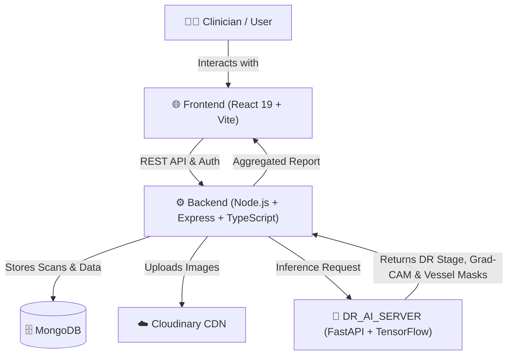

# </img> DRDtechAI - Full-Stack Diabetic Retinopathy Detection System.

An end-to-end AI-powered Medical Detection  Platform designed for automated **Diabetic Retinopathy (DR) grading**, **Grad-CAM explainability heatmaps**, and **retinal blood vessel segmentation** from fundus photographs.

---

## 🌟 System Overview

The **DRDtechAI** ecosystem consists of three integrated microservices:


---
1. **[Frontend](https://github.com/manojsargam-dev/DRDtech-AI/blob/main/Frontend/README.md)**: Modern, responsive React 19 web application for patient intake, scan upload, and Detection  report visualization.
2. **[Backend](https://github.com/manojsargam-dev/DRDtech-AI/blob/main/Backend/README.md)**: Node.js / Express / TypeScript API server handling user authentication, patient records, Cloudinary storage, and ML workflow orchestration.
3. **[ML](https://github.com/manojsargam-dev/DRDtech-AI/blob/main/ML/README.md)**: Python / FastAPI deep learning microservice hosting fine-tuned **ResNet-101** (APTOS dataset) and **U-Net** (DRIVE dataset) models.
---
## 🚀 Key Features

- **Automated Diabetic Retinopathy Classification**: 5-stage clinical severity grading (No DR, Mild, Moderate, Severe, Proliferative DR) using fine-tuned ResNet-101.
- **Explainable AI (Grad-CAM Heatmaps)**: Visualizes the anatomical regions in retinal fundus images that influenced the Detection  decision.
- **Retinal Blood Vessel Segmentation**: High-precision vascular tree extraction using a deep U-Net architecture.
- **Secure Authentication & Patient Records**: End-to-end patient management with JWT-based security and MongoDB database.
- **Cloud Image Pipeline**: Automated retinal image upload, optimization, and storage with Cloudinary.
- **Comprehensive Detection  Reports**: Interactive visual report comparing original fundus scans, Grad-CAM overlays, and vessel segmentation masks with clinical action items.

---

## 📋 Prerequisites

Before setting up the project, make sure you have installed:
- [Git](https://git-scm.com/)
- [Node.js](https://nodejs.org/) (v18.0.0 or higher with `npm`)
- [Python](https://www.python.org/) (v3.10 or v3.11 with `pip`)
- [MongoDB](https://www.mongodb.com/try/download/community) (Local instance or MongoDB Atlas)
- [Cloudinary Account](https://cloudinary.com/) (For image hosting credentials)

---

## 💻 How To Use & Quickstart

To clone and run the full stack application, follow the step-by-step instructions below.

### 1. Clone the Repository

```bash
# Clone this repository
$ git clone https://github.com/manojsargam-dev/DRDtech-AI.git
# Wait little time for downloading model

# Navigate into the project root
$ cd "DRDtechAI"
```

---

### 2. Start the AI Server (`DR_AI_SERVER`)

```bash
# Go into the AI server directory
$ cd ML

# Create and activate virtual environment
$ python -m venv venv

# Windows (PowerShell):
$ .\venv\Scripts\Activate.ps1
# Windows (cmd):
$ venv\Scripts\activate
# Linux / macOS / Bash:
$ source venv/bin/activate

# Install Python dependencies
$ pip install -r requirements.txt.utf8

# Run the AI server (starts on http://localhost:8000)
$ uvicorn app.main:app --reload --host 0.0.0.0 --port 8000
```

---

### 3. Start the Backend API (`Backend`)

Open a new terminal window:

```bash
# Go into the Backend directory
$ cd "DRDtechAI/Backend"

# Install Node dependencies
$ npm install

# Copy environment variables and fill your credentials
$ cp .env.example .env

# Run the backend development server (starts on http://localhost:3000)
$ npm run dev
```

---

### 4. Start the Frontend Application (`Frontend`)

Open a third terminal window:

```bash
# Go into the Frontend directory
$ cd "DRDtechAI/Frontend"

# Install dependencies
$ npm install

# Copy environment variables
$ cp .env.example .env

# Run the Vite development server (starts on http://localhost:5173)
$ npm run dev
```

Open `http://localhost:5173` in your browser to access the application.

---

## ⚙️ Environment Configuration

> [!IMPORTANT]
> Populate your `.env` keys with their respective values in both `Backend/` and `Frontend/` directories before starting the services.

### `Backend/.env`
```env
PORT=3000
MONGO_URI=your_mongodb_cluster_uri
SECRET=your_jwt_secret_key
EXPIRES=7d
CLOUDINARY_CLOUD_NAME=your_cloudinary_cloud_name
CLOUDINARY_API_KEY=your_cloudinary_api_key
CLOUDINARY_API_SECRET=your_cloudinary_api_secret
CLIENT_URL=http://localhost:5173
ML_SERVICE_URL=http://localhost:8000
```

### `Frontend/.env`
```env
VITE_API_URL=http://localhost:3000
VITE_ML_API_URL=http://localhost:8000
```

> [!NOTE]
> If you are using Linux Bash for Windows (WSL), make sure MongoDB is running via `sudo service mongodb start` or connect using your remote MongoDB Atlas URI.


